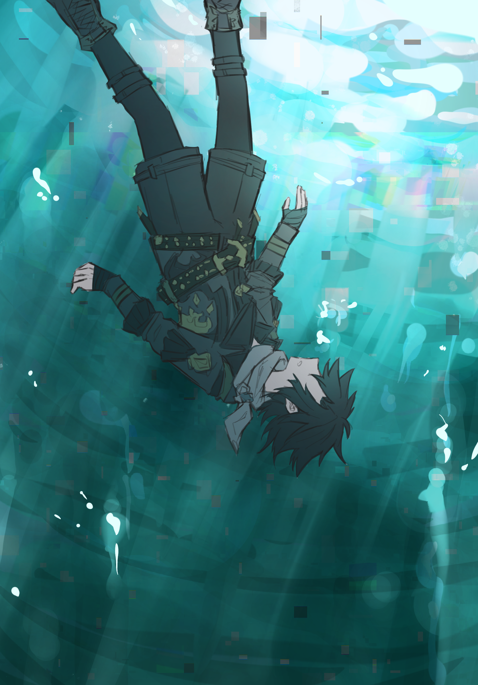
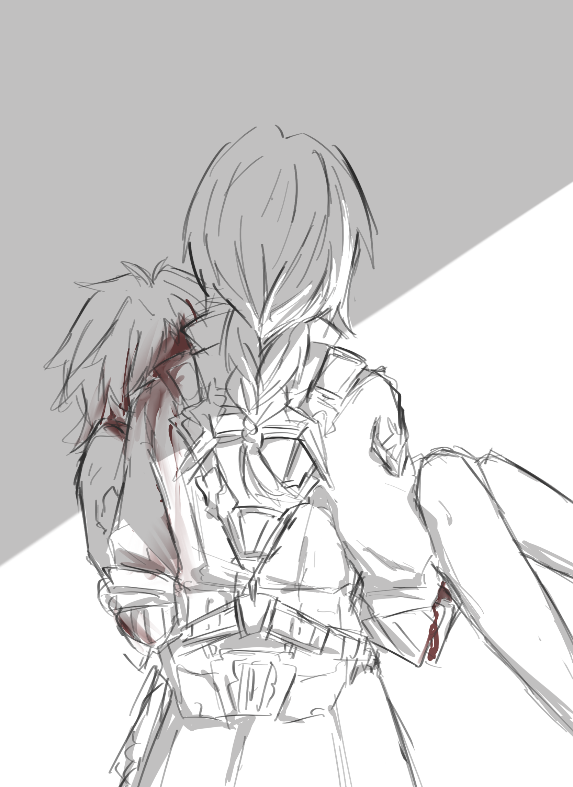
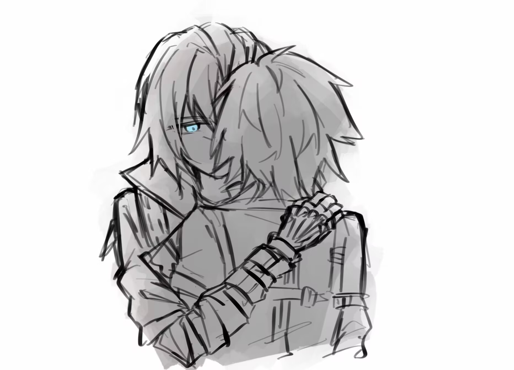

_Photography by Inominata_

[返回](../)

* * *

<link rel="stylesheet" href="{{ '../docs/assets/css/style.css' | relative_url }}">

    
    
    
    
    
    
    
    
    
    
    
    
    
    
    
    
    
    
    
    
    
    
    
    
    
    
    
    

* * *

[返回](../)

 