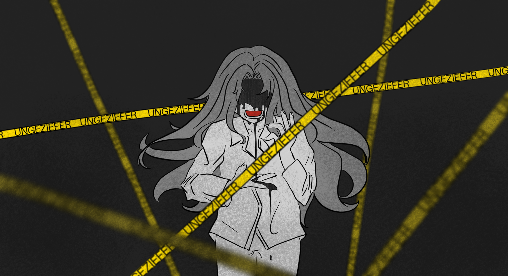

_Statements Recorded by Hamster4_

[返回](../)

* * *

 

-上次说的要点，还记得吗？

-……嗯。呼吸平稳，全身放松，握枪不要太用力……扣扳机也是。

-好。你的准头不错，今天从三十米练起。记得，瞄准远处的目标要抬一点枪口，子弹的路径是抛物线。

-明白。

-开始吧。

 

* * *

 

-那孩子……是叫斯泰纳尔来着吧？我记得他。那批小兵里少数几个活到成年的人之一。也难怪是他能活到那岁数——他从那时候起就不太像个小孩，话不多，别的小兵把弹壳黏一起当积木玩的时候他在边上擦刺刀，别人给什么指令他就做。也是他运气好，跟着的人没给他喂过什么药，也没轮上他做人肉炸弹……不过怎么说呢，有点死气沉沉的。不知道他现在怎么样了。

 

* * *

 

-“雷酸汞”。单从这代号就能看出他是什么人——要是这么想可就错了。是，他擅长摆弄炸药，也干过不少字面意义上爆炸性的大事，但是驱动他的……我说不好。你可以说他的动力是愤怒与怨怼，但你也得记得，他的情绪源于同类遭受了不公正的待遇。是保护欲吧？也可以说是对同胞的爱。他自己估计不会觉得那是爱，但总之就是那么一回事。那些东西把他困住了。事到如今他还是没能挣脱……唉。对他来说大概是不可能的吧。

 

* * *

[返回](../)

 
