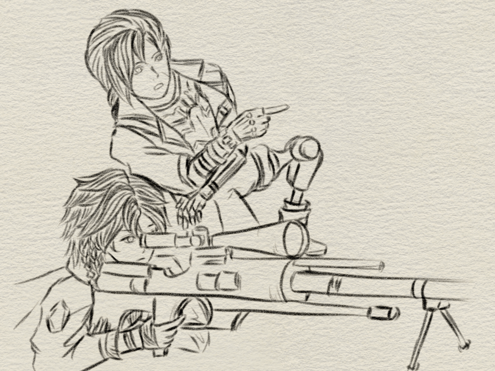
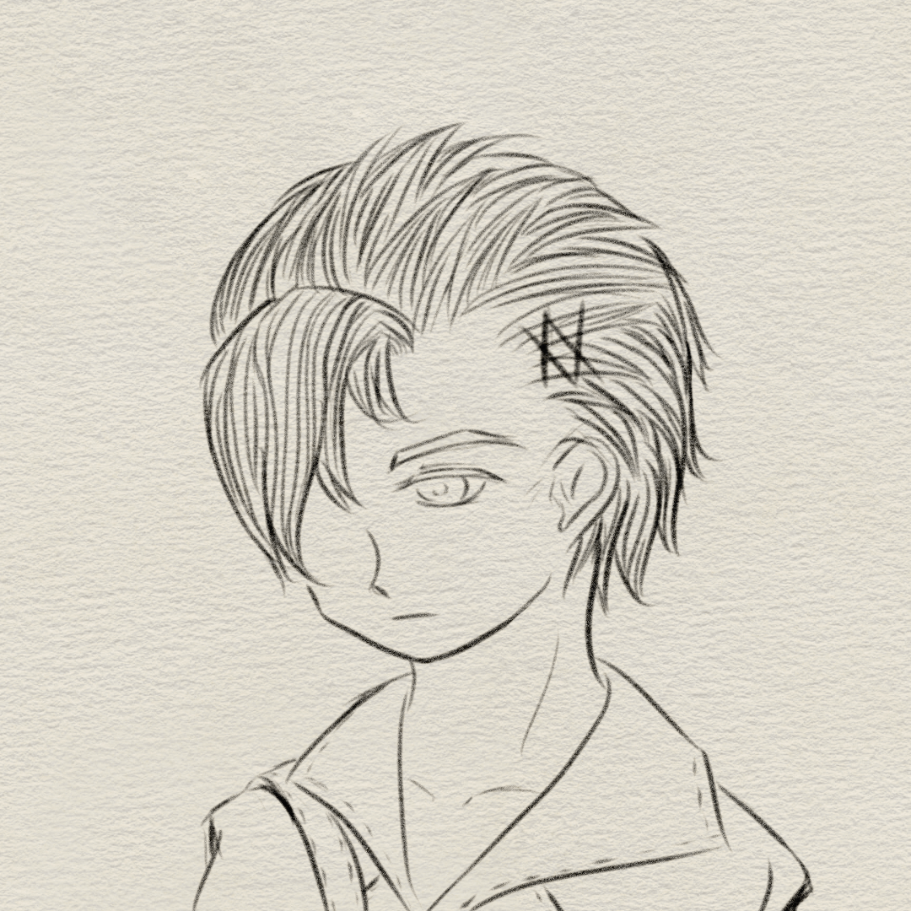

_Statement Recording and Profiling by Hamster4_

[返回](../)

* * *

 

-上次说的要点，还记得吗？

-……嗯。呼吸平稳，全身放松，握枪不要太用力……扣扳机也是。

-好。你的准头不错，今天从三十米练起。记得，瞄准远处的目标要抬一点枪口，子弹的路径是抛物线。

-明白。

-开始吧。

 

* * *

 

-那孩子……是叫斯泰纳尔来着吧？我记得他。那批小兵里少数几个活到成年的人之一。也难怪是他能活到那岁数——他从那时候起就不太像个小孩，话不多，别的小兵把弹壳黏一起当积木玩的时候他在边上擦刺刀，别人给什么指令他就做。也是他运气好，跟着的人没给他喂过什么药，也没轮上他做人肉炸弹……不过怎么说呢，有点死气沉沉的。不知道他现在怎么样了。

 

* * *

[返回](../)
