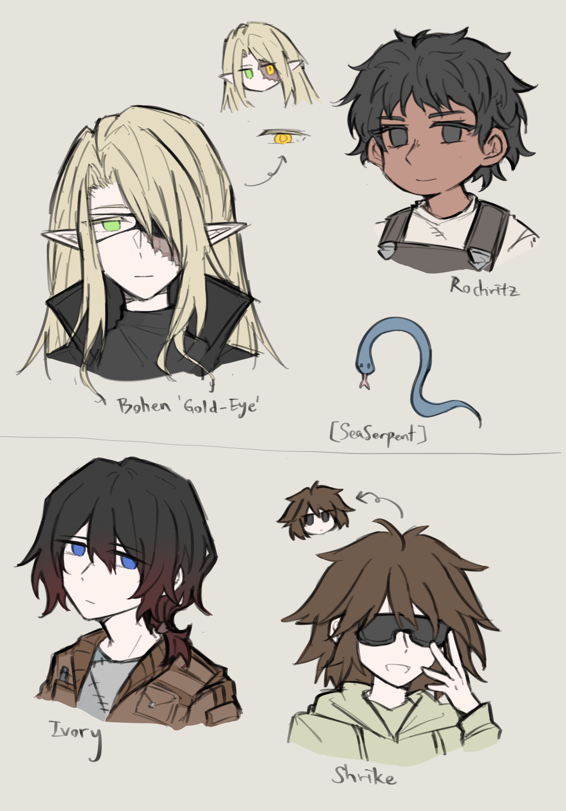
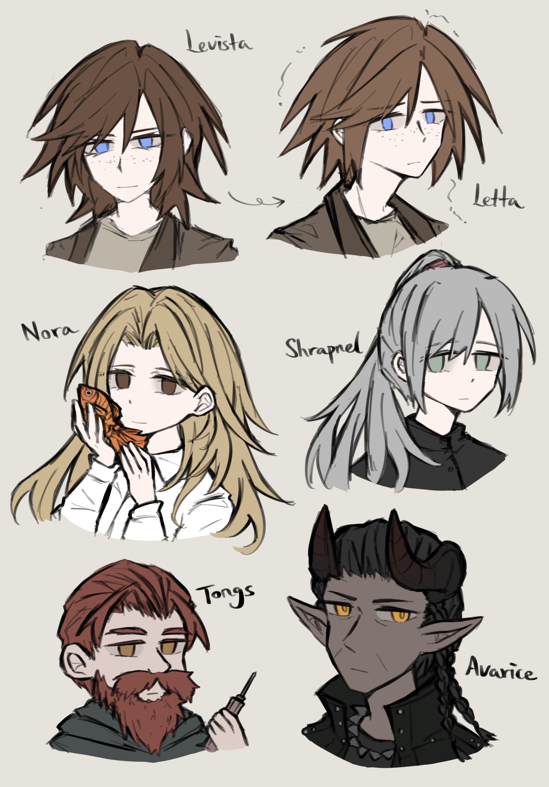
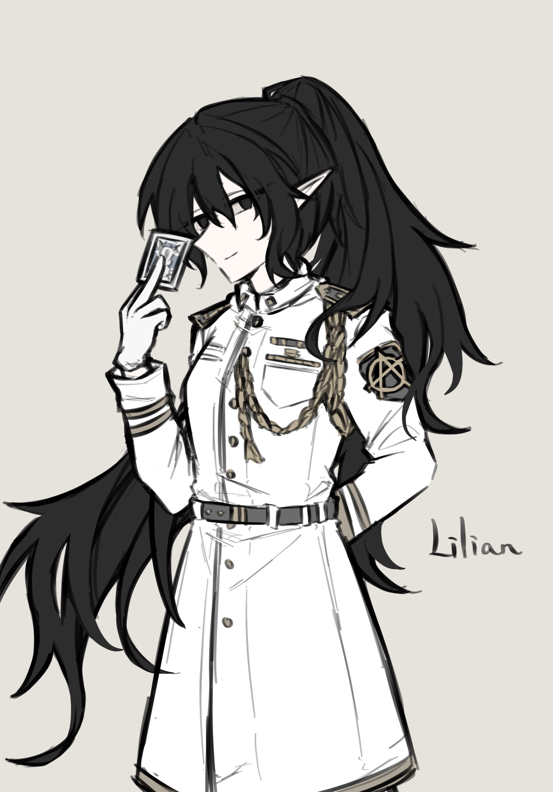
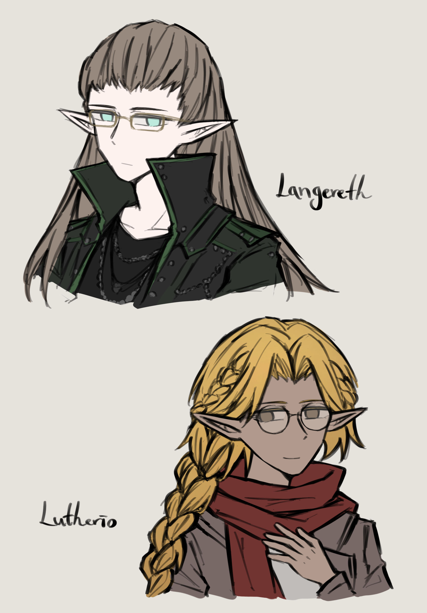

## 相关人员档案

_Sketches by Inominata_

_Edited by Hamster4_

_档案状态：调查中_

[返回](../)

* * *

 

**博恩 Bohen**

**【金眼 Gold-Eye】**

<dl>
<dt>性别认同</dt>
<dd>男</dd>
<dt>年龄</dt>
<dd>27</dd>
<dt>泛形态</dt>
<dd>精灵</dd>
<dt>当前状态</dt>
<dd>活跃</dd>
</dl>

安缇诺雅的熟人，狂奔者。绰号得来于早年受伤，后来被替换成金属义眼的左眼。义眼可以作为无人机使用，外出侦察时会戴上眼罩防止进灰。与古人帮维持着友善的关系。

 

**罗赫利兹 Rochritz**

**【养蜂人 beekeeper】**

<dl>
<dt>性别认同</dt>
<dd>女</dd>
<dt>年龄</dt>
<dd>30</dd>
<dt>泛形态</dt>
<dd>矮人</dd>
<dt>当前状态</dt>
<dd>活跃</dd>
</dl>

安缇诺雅的熟人，狂奔者，机师。绰号得来于对无人机的执着与热爱。在狂奔生活之余，也作为机械师维护修理同行们的各类设施。

 

**【海蛇 SeaSerpent】**

<dl>
<dt>性别认同</dt>
<dd>不明</dd>
<dt>年龄</dt>
<dd>不明</dd>
<dt>泛形态</dt>
<dd>人类</dd>
<dt>当前状态</dt>
<dd>活跃</dd>
</dl>

安缇诺雅的熟人，警察。执勤时从不露出脸，除了泛形态一切状况不明。消息很灵通，似乎是因为与不止一位狂奔者达成了情报交易上的协议。

 

**艾弗里 Ivory**

<dl>
<dt>性别认同</dt>
<dd>男</dd>
<dt>年龄</dt>
<dd>25</dd>
<dt>泛形态</dt>
<dd>人类</dd>
<dt>当前状态</dt>
<dd>活跃</dd>
</dl>

锯刃帮成员，机械师，偶尔也担任医生的职责。是个喜欢往家里带各种小零件的垃圾佬。小伯劳某种意义上的看护人。名字来源于他被人捡到收养时装着他的盒子，似乎曾用于装某种电子产品的“象牙白”型号。

 

**伯劳 Shrike**

<dl>
<dt>性别认同</dt>
<dd>流动</dd>
<dt>年龄</dt>
<dd>约15~17</dd>
<dt>泛形态</dt>
<dd>人类</dd>
<dt>当前状态</dt>
<dd>活跃</dd>
</dl>

龙血幸存者，机械师学徒。被亲近的年长者称为“小伯劳 Shrikey”。好奇于超链者的能力，避免对不信任的人暴露自己的同时，小心翼翼地试探自己能做到的事。名字来源于小鸟般咋咋呼呼的性格和几乎是焊在脸上的黑色护目镜。

 

**莱维斯塔 Levista （莱塔 Letta）**

<dl>
<dt>性别认同</dt>
<dd>女</dd>
<dt>年龄</dt>
<dd>26（享年）</dd>
<dt>泛形态</dt>
<dd>人类</dd>
<dt>当前状态</dt>
<dd>死亡</dd>
</dl>

制造“龙血”的主导者之一。超链者，希望与天演公司进行合作，通过龙血推动泛人类“进入进化的下一个阶段”。曾使用假面术改变自己的外貌，化名莱塔亲自贩卖炼金药剂。死于枪伤及割喉导致的大量失血。

 

**诺拉 Nora**

<dl>
<dt>性别认同</dt>
<dd>女</dd>
<dt>年龄</dt>
<dd>22（享年）</dd>
<dt>泛形态</dt>
<dd>人类</dd>
<dt>当前状态</dt>
<dd>死亡</dd>
</dl>

平民。在对一成不变的生活愈发感到麻木绝望之际遇见了莱维斯塔，被其强烈的信念感所吸引，自愿加入了她的计划。被俘虏后在莱维斯塔的暗示下服毒自杀，死于氰化物中毒。

 

**【霰弹 Shrapnel】**

<dl>
<dt>性别认同</dt>
<dd>女</dd>
<dt>年龄</dt>
<dd>28（享年）</dd>
<dt>泛形态</dt>
<dd>人类</dd>
<dt>当前状态</dt>
<dd>死亡</dd>
</dl>

狂奔者，机枪手。本性软弱，但在狂奔生涯中学会了如何狠下心。有一个因为BTL芯片上瘾欠下巨额债款的妹妹，为帮其偿还债务而参加了报酬很高的工作。从疾驰的车上被扔下后，头部遭碾压而死。

 

**【钢钳 Tongs】**

<dl>
<dt>性别认同</dt>
<dd>男</dd>
<dt>年龄</dt>
<dd>40（享年）</dd>
<dt>泛形态</dt>
<dd>矮人</dd>
<dt>当前状态</dt>
<dd>死亡</dd>
</dl>

狂奔者，机师。说话直接且刻薄，不好相处，但有着身为矮人的义气。曾被阿瓦利斯救过一命，为报恩而加入了他的队伍。在战斗中被利刃穿胸而死。

 

**阿瓦利斯 Avarice**

<dl>
<dt>性别认同</dt>
<dd>男</dd>
<dt>年龄</dt>
<dd>42（享年）</dd>
<dt>泛形态</dt>
<dd>巨魔</dd>
<dt>当前状态</dt>
<dd>死亡</dd>
</dl>

制造“龙血”的主导者之一。只能以炼金术形式施法的专精法师。从矩阵上获取了残缺的炼金药剂制作配方，希望能将其完善并抛售给超企。曾试图刺杀莱维斯塔以获得必要的媒介，失败后以“推动进化”的借口劝说她加入计划。死于头部中弹。

 

**莉莉安 Lilian**

<dl>
<dt>性别认同</dt>
<dd>女</dd>
<dt>年龄</dt>
<dd>47</dd>
<dt>泛形态</dt>
<dd>精灵</dd>
<dt>当前状态</dt>
<dd>活跃</dd>
</dl>

为了追回朋友的遗骨，从西雅图来到伦敦的古人帮中尉，不知为何没有穿着帮派的标准服装。让人看不透的笑面虎。在结交盟友前，习惯于用一局扑克试探对方的性格与处事方式。

 

**兰吉瑞斯 Langereth**

<dl>
<dt>性别认同</dt>
<dd>男</dd>
<dt>年龄</dt>
<dd>38</dd>
<dt>泛形态</dt>
<dd>精灵</dd>
<dt>当前状态</dt>
<dd>活跃</dd>
</dl>

古人帮的驻伦敦小队长，莉莉安曾经的下属。作为帮派队长处事手段称得上温和。不知从哪里学来了一些旧时代的习俗，例如在受到挑衅时以摘下手套甩在对方脸上的方式发起决斗。

 

**卢塞里欧 Lutherio**

<dl>
<dt>性别认同</dt>
<dd>男</dd>
<dt>年龄</dt>
<dd>41（享年）</dd>
<dt>泛形态</dt>
<dd>精灵</dd>
<dt>当前状态</dt>
<dd>死亡</dd>
</dl>

超链者，拉丁美洲裔。在产业经营方面为古人帮出谋划策的编外顾问，对外维持着普通自由职业者的伪装。于2069年被万圣帮成员枪杀。部分遗骨在数年后被盗取至伦敦。

 

* * *

[返回](../)
