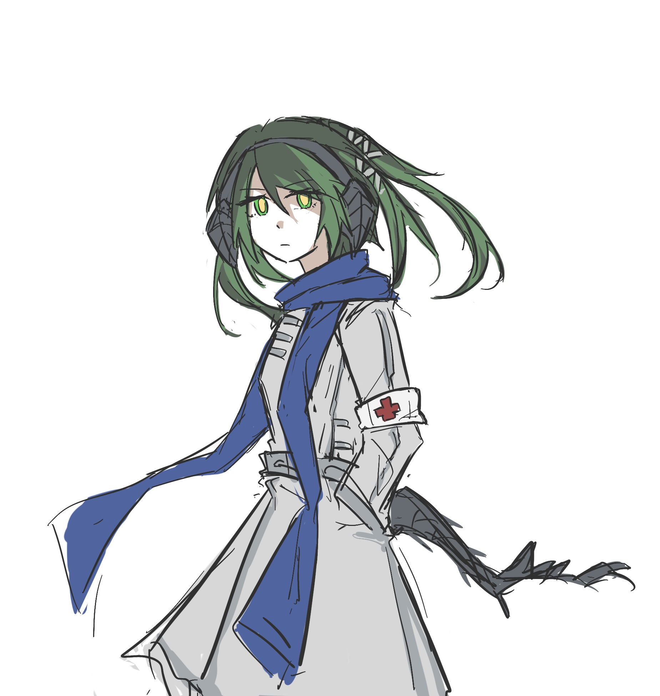
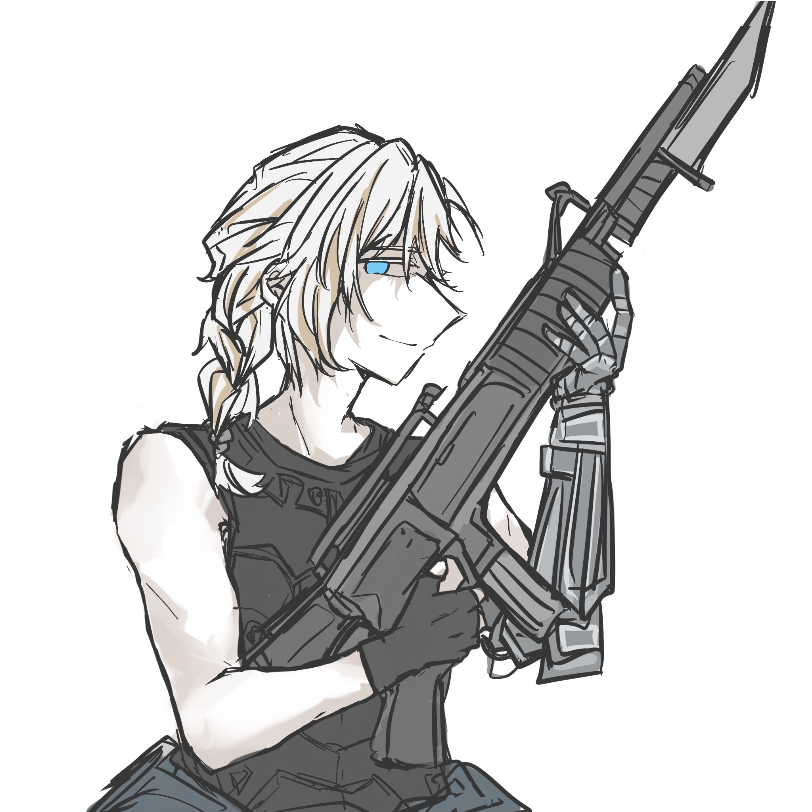
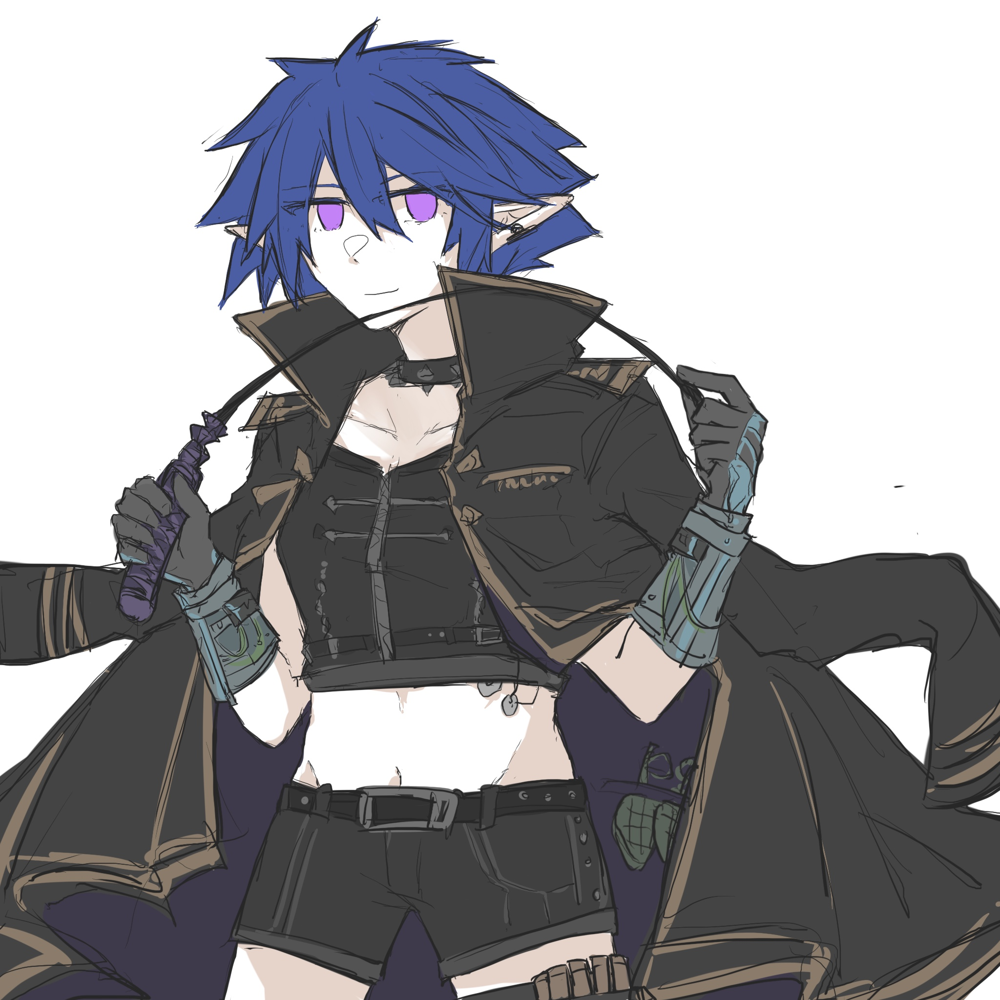
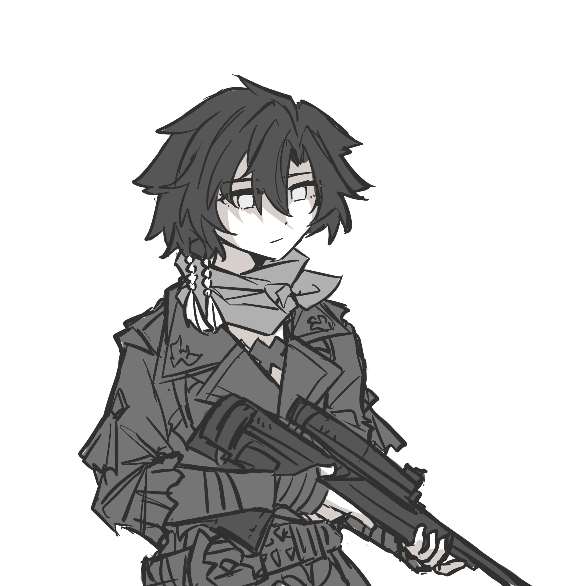
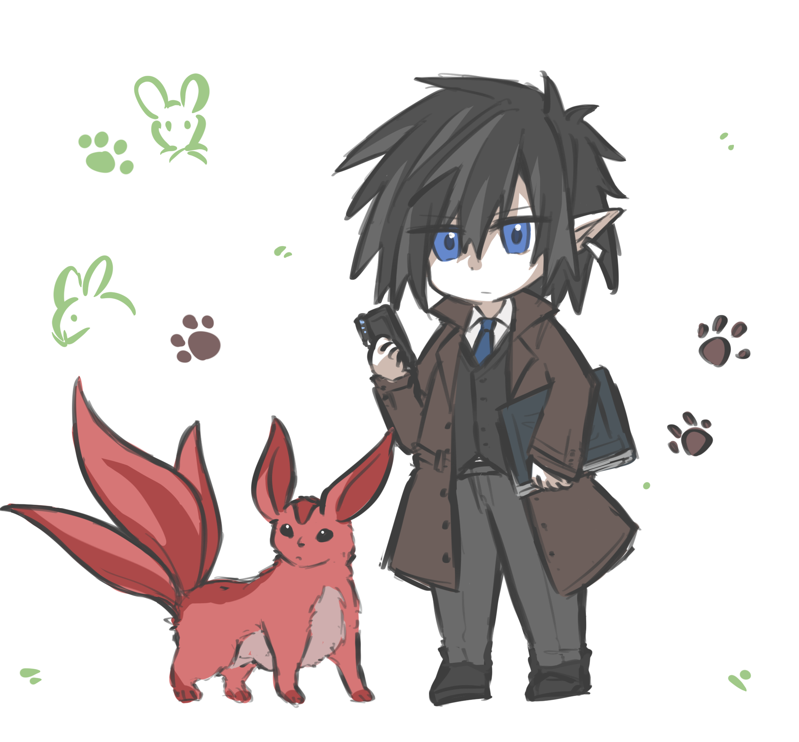
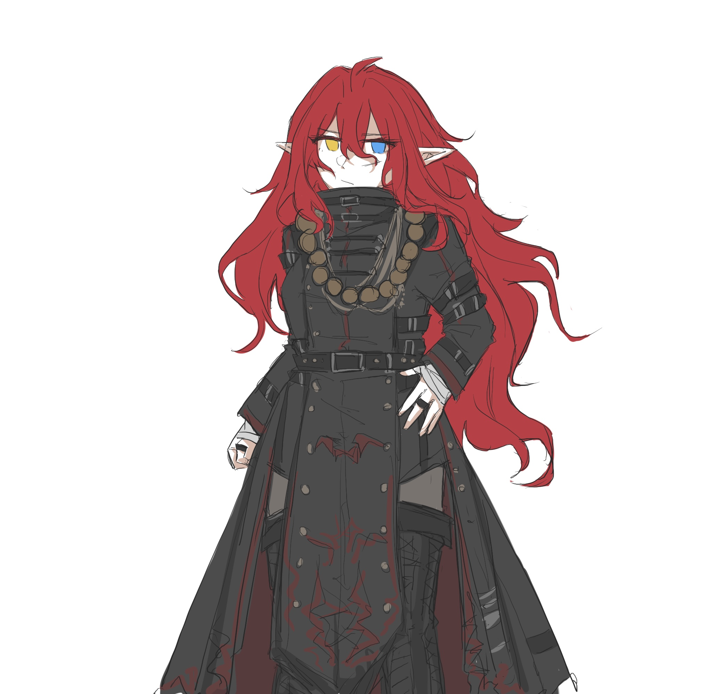

## 狂奔者档案（1）

_Photography by Inominata_

_Edited by Hamster4_

_档案状态：调查中_

[返回](../)

* * *

 

<dl>
<dt>姓名/代称</dt>
<dd>希尔维娅·浩特革 【红十字】 Salvia Hotgo [Red Cross]</dd>
<dt>狂奔经验</dt>
<dd>精英</dd>
<dt>出生地</dt>
<dd>澳大利亚共和国</dd>
<dt>性别</dt>
<dd>女</dd>
<dt>年龄</dt>
<dd>23</dd>
<dt>泛形态</dt>
<dd>人类（替换儿）</dd>
<dt>信誉</dt>
<dd>4</dd>
<dt>当前状态</dt>
<dd>活跃</dd>
</dl>

<dl>
<dt>肉体素质评测</dt>
<dd>体质-2  敏捷-3  反应-3  力量-1</dd>
<dt>精神素质评测</dt>
<dd>意志-3  逻辑-4  直觉-4  魅力-2</dd>
<dt>觉醒/显现</dt>
<dd>觉醒者（魔法-3）</dd>
<dt>改造与殖装</dt>
<dd>无</dd>
</dl>

 

心知这是不现实的梦想，却仍然渴望拯救所有人的医师。年轻时曾跟随导师在北欧游历。在工作之余救护受伤的人，被伦敦的暗影居民们称为“龙小姐”。

 

**辨识性特质**

<dl>
<dt>觉醒者-法师（宇宙学派）</dt>
<dd>能够使用各类法术的施法者。从属于主张魔法来源于宇宙，重视逻辑与探索的魔法流派。</dd>
<dt>功能性尾巴</dt>
<dd>长有覆鳞的长尾，末端有尖锐的钉刺。</dd>
<dt>荣誉守则-希波克拉底誓言</dt>
<dd>已被时代抛弃的古老誓言。如有能力必须提供医疗援助。不得使用危害性药物。必须保持病人的信心。</dd>
</dl>

 

 

<dl>
<dt>姓名/代称</dt>
<dd>斯泰纳尔·布雷德斯 【木帆船】 Steinar Blades [Wood Sailboat]</dd>
<dt>狂奔经验</dt>
<dd>精英</dd>
<dt>出生地</dt>
<dd>巴尔干半岛</dd>
<dt>性别</dt>
<dd>男</dd>
<dt>年龄</dt>
<dd>28</dd>
<dt>泛形态</dt>
<dd>人类</dd>
<dt>信誉</dt>
<dd>4</dd>
<dt>当前状态</dt>
<dd>活跃</dd>
</dl>

<dl>
<dt>肉体素质评测</dt>
<dd>体质-5  敏捷-5  反应-5  力量-6</dd>
<dt>精神素质评测</dt>
<dd>意志-2  逻辑-2  直觉-4  魅力-3</dd>
<dt>觉醒/显现</dt>
<dd>无</dd>
<dt>改造与殖装</dt>
<dd>机械义肢-整腿（配件：赛博武器匣）；机械义肢-前臂（配件：内置式稳定装置；植入武装-轻型手枪/钢刺爪/手刃）</dd>
</dl>

 

曾是雇佣兵。所属的小队在一次高危任务中全灭，于濒死之际被希尔维娅救下，跟随她来到了伦敦。已经适应了使用义肢作战。

 

**辨识性特质**

<dl>
<dt>天资（利刃）</dt>
<dd>使用冷兵器的天赋。包括传统的刀具，以及在义肢中植入的可伸缩爪刃。</dd>
<dt>双巧手</dt>
<dd>能够以同样的灵活与熟练操控双手。</dd>
<dt>高度耐痛</dt>
<dd>身负重伤时，仍能忍耐痛觉继续行动。</dd>
</dl>

 

 

<dl>
<dt>姓名/代称</dt>
<dd>安缇诺雅 【音爆】 Antinoa [Sonic Boom]</dd>
<dt>狂奔经验</dt>
<dd>精英</dd>
<dt>出生地</dt>
<dd>加拿大与美利坚合众国</dd>
<dt>性别</dt>
<dd>女</dd>
<dt>年龄</dt>
<dd>27</dd>
<dt>泛形态</dt>
<dd>精灵</dd>
<dt>信誉</dt>
<dd>4</dd>
<dt>当前状态</dt>
<dd>活跃</dd>
</dl>

<dl>
<dt>肉体素质评测</dt>
<dd>体质-3  敏捷-5  反应-5  力量-3</dd>
<dt>精神素质评测</dt>
<dd>意志-3  逻辑-5  直觉-4  魅力-3</dd>
<dt>觉醒/显现</dt>
<dd>无</dd>
<dt>改造与殖装</dt>
<dd>中控器；反应增强器</dd>
</dl>

 

年轻时曾与希尔维娅追随同一位导师，然而由于缺乏施法天赋并出于急功近利造成了一场意外，与那两人分道扬镳。为甩开自己的过去捏造了新的名字。在伦敦成长为一名老练的狂奔者后，意料之外地与希尔维娅重逢。

 

**辨识性特质**

<dl>
<dt>低光视觉</dt>
<dd>身为精灵的种族优势。可以在昏暗的光线下如常视物。</dd>
<dt>应急机师</dt>
<dd>对于机械构成及运行原理的高度熟悉。能够在紧要关头制造应急设备，或对受损的设备进行临时修补。</dd>
<dt>高度耐痛</dt>
<dd>身负重伤时，仍能忍耐痛觉继续行动。</dd>
</dl>

 

 

<dl>
<dt>姓名/代称</dt>
<dd>伯特仑·梅钦 【寒鸦】 Bertram Machin [Jackdaw]</dd>
<dt>狂奔经验</dt>
<dd>丰富</dd>
<dt>出生地</dt>
<dd>英国</dd>
<dt>性别</dt>
<dd>男</dd>
<dt>年龄</dt>
<dd>21</dd>
<dt>泛形态</dt>
<dd>人类</dd>
<dt>信誉</dt>
<dd>3</dd>
<dt>当前状态</dt>
<dd>失踪</dd>
</dl>

<dl>
<dt>肉体素质评测</dt>
<dd>体质-1  敏捷-3  反应-2  力量-2</dd>
<dt>精神素质评测</dt>
<dd>意志-4  逻辑-6  直觉-4  魅力-3</dd>
<dt>觉醒/显现</dt>
<dd>超链者（共鸣-3）</dd>
<dt>改造与殖装</dt>
<dd>植入式通讯链与数据接口</dd>
</dl>

 

曾是公司员工，从属于技术研发部门。在一起投毒事件中成为唯一的幸存者，销毁过去的身份并向投毒者复仇后成为暗影一员。当前由于与龙血的接触被三津滨带走，下落不明。

 

**辨识性特质**

<dl>
<dt>天才启发者</dt>
<dd>与计算机及矩阵的亲和。擅于利用矩阵进行复杂的数据处理。</dd>
<dt>学院教育</dt>
<dd>得益于曾接受的教育，对学术知识的熟悉与掌握。</dd>
<dt>龙血接触者</dt>
<dd>曾接触过名为“龙血”的炼金药剂并幸存。体质被极大削弱的同时，被强行唤醒了超链者的能力。</dd>
</dl>

 

 

<dl>
<dt>姓名/代称</dt>
<dd>夏尔卡·托尔卡 【红宝石松鼠】 Celka Tolka [Ruby Squirrel]</dd>
<dt>狂奔经验</dt>
<dd>丰富</dd>
<dt>出生地</dt>
<dd>法国</dd>
<dt>性别</dt>
<dd>男</dd>
<dt>年龄</dt>
<dd>20</dd>
<dt>泛形态</dt>
<dd>矮人（侏儒）</dd>
<dt>信誉</dt>
<dd>3</dd>
<dt>当前状态</dt>
<dd>活跃</dd>
</dl>

<dl>
<dt>肉体素质评测</dt>
<dd>体质-2  敏捷-4  反应-2  力量-1</dd>
<dt>精神素质评测</dt>
<dd>意志-3  逻辑-3  直觉-4  魅力-6</dd>
<dt>觉醒/显现</dt>
<dd>无</dd>
<dt>改造与殖装</dt>
<dd>植入式通讯链与数据接口</dd>
</dl>

 

曾是公司员工，从属于人事部门。意识到公司粉饰太平下的真实面目后，出于恐惧离开了曾经的生活。在小队中主要负责交涉。

 

**辨识性特质**

<dl>
<dt>幼态持续</dt>
<dd>无论其实际年龄为何，外观看上去都像人类或精灵的小孩子。每个侏儒都饱受其困扰的问题。</dd>
<dt>法术绝缘</dt>
<dd>魔法难以对其起效。一个引起许多人兴趣的种族特性。</dd>
<dt>第一印象</dt>
<dd>言谈举止会在初识时便给人留下良好的印象。身为出面人必不可少的天赋。</dd>
</dl>

 

 

<dl>
<dt>姓名/代称</dt>
<dd>阿德瑞娜·密斯托 【雨云】 Adriana Myste [Raincloud]</dd>
<dt>狂奔经验</dt>
<dd>精英</dd>
<dt>出生地</dt>
<dd>英国</dd>
<dt>性别</dt>
<dd>女</dd>
<dt>年龄</dt>
<dd>22</dd>
<dt>泛形态</dt>
<dd>精灵</dd>
<dt>信誉</dt>
<dd>4</dd>
<dt>当前状态</dt>
<dd>活跃</dd>
</dl>

<dl>
<dt>肉体素质评测</dt>
<dd>体质-5  敏捷-3  反应-4  力量-4</dd>
<dt>精神素质评测</dt>
<dd>意志-5  逻辑-2  直觉-4  魅力-4</dd>
<dt>觉醒/显现</dt>
<dd>觉醒者（魔法-6）</dd>
<dt>改造与殖装</dt>
<dd>无</dd>
</dl>

 

被抛弃后在东伦敦的巷子里长大的流浪儿。秉承着十分朴素且强烈的正义感，希望能够保护东伦敦的居民们。魔法天赋曾经引起过某些人的觊觎。

 

**辨识性特质**

<dl>
<dt>低光视觉</dt>
<dd>身为精灵的种族优势。可以在昏暗的光线下如常视物。</dd>
<dt>觉醒者-神秘修士（阿兹特克流派）</dt>
<dd>既受到了魔法对肉体的强化，又能自由施展法术的天赋。从属于相信每个人都与一个“兽魂”双生乃至共享灵魂，重视其精魂导师的魔法流派。</dd>
<dt>精魂导师-雷鸟</dt>
<dd>印第安文化中掌控天气的巨鸟。主导雷霆般的愤怒与以牙还牙的精魂导师。</dd>
<dt>至爱亲朋</dt>
<dd>在维持生活所需之余，还照顾着几个收养的孩子。</dd>
</dl>

 

* * *

[返回](../)
