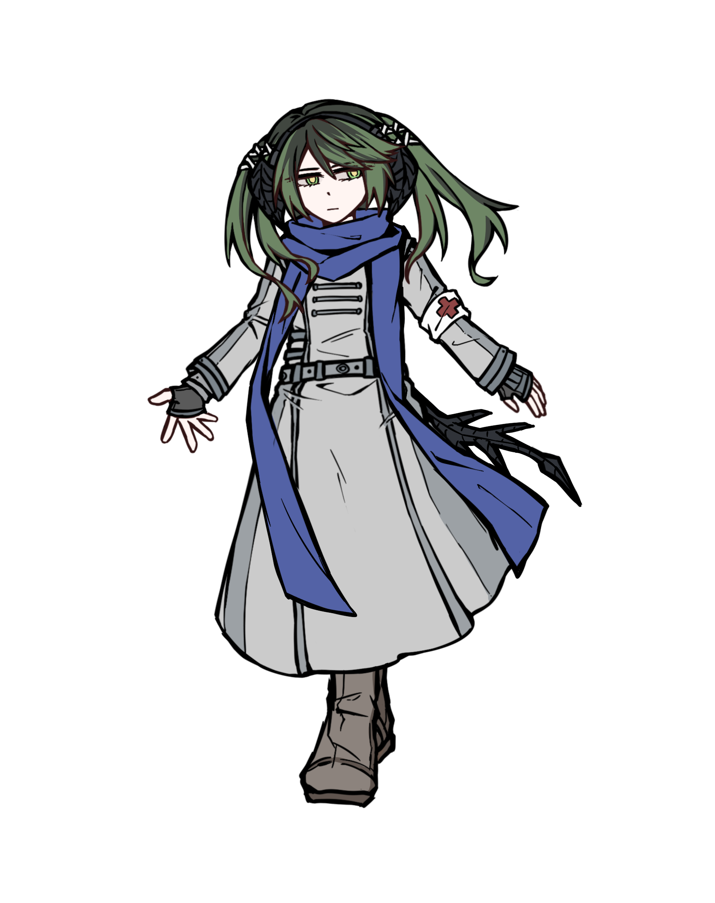
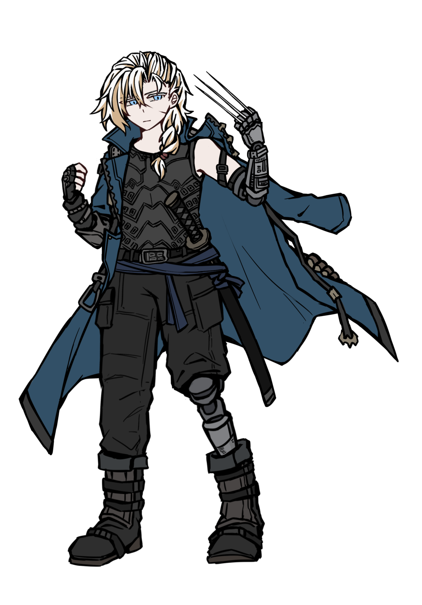
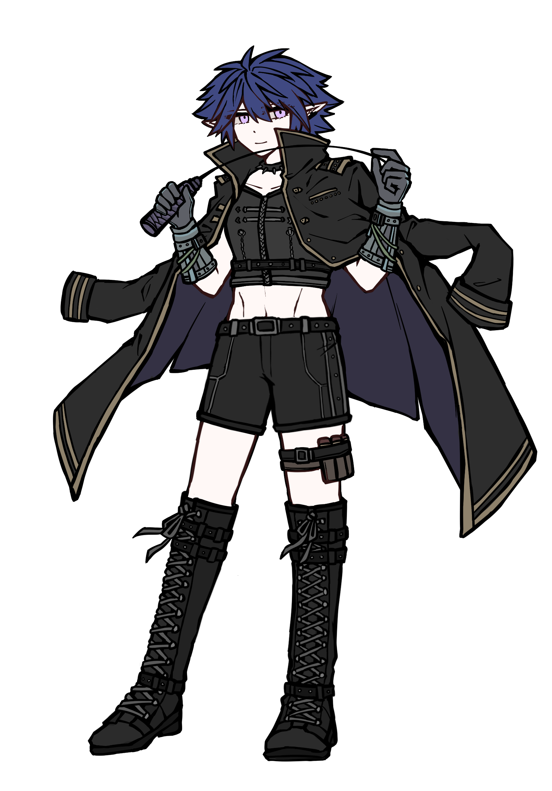
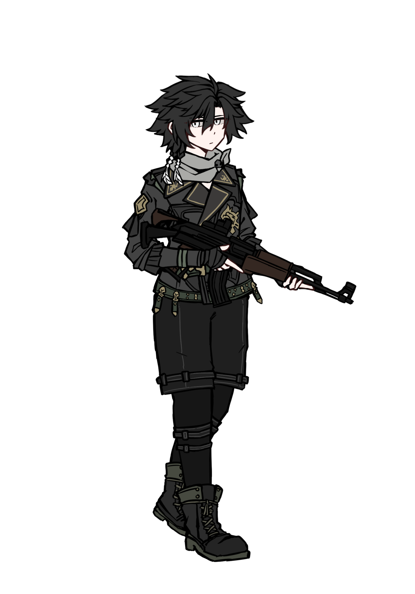
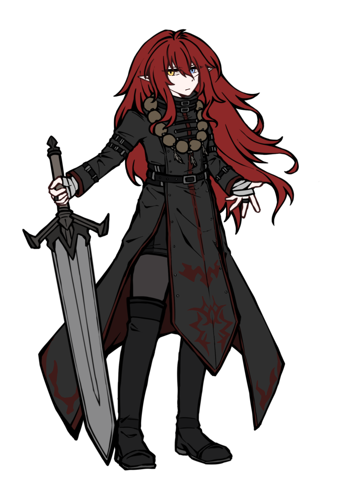
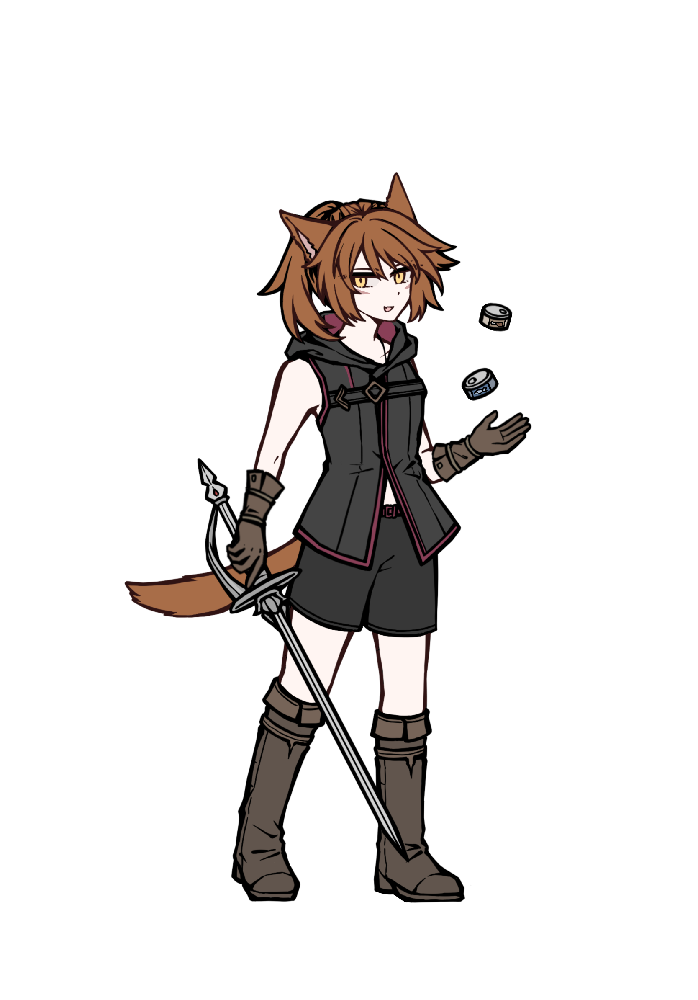

## 狂奔者档案（1）

_Sketches by Inominata_

_Edited by Hamster4_

_档案状态：调查中_

[返回](../)

* * *

 

**希尔维娅·浩特革 Salvia Hotgo**

**【红十字 Red Cross】**

<table>
  <tr>
    <td>狂奔经验</td>
    <td>精英</td>
  </tr>
  <tr>
    <td>出生地</td>
    <td>澳大利亚共和国</td>
  </tr>
  <tr>
    <td>泛形态</td>
    <td>人类（替换儿）</td>
  </tr>
  <tr>
    <td>年龄</td>
    <td>23</td>
  </tr>
  <tr>
    <td>性别认同</td>
    <td>女</td>
  </tr>
  <tr>
    <td>当前状态</td>
    <td>静默</td>
  </tr>
  <tr>
    <td>肉体素质评测</td>
    <td>体质-2  敏捷-3  反应-3  力量-1</td>
  </tr>
  <tr>
    <td>精神素质评测</td>
    <td>意志-3  逻辑-4  直觉-4  魅力-2</td>
  </tr>
  <tr>
    <td>觉醒/显现</td>
    <td>觉醒者（魔法-3）</td>
  </tr>
  <tr>
    <td>改造与殖装</td>
    <td>无</td>
  </tr>
</table>

狂奔者小队队长。心知这是不现实的梦想，却仍然渴望拯救所有人的医师。澳大利亚原住民，父母病故后曾跟随导师在北欧游历。被伦敦的暗影居民们称为“龙小姐”。

**辨识性特质**

<dl>
<dt>觉醒者-法师（宇宙学派）</dt>
<dd>能够自由使用各类法术的施法者。从属于主张魔法来源于宇宙，重视逻辑与探索的魔法流派。</dd>
<dt>替换儿</dt>
<dd>出生前受到魔法乱流的影响，发育出非泛人类的特征；体现为覆鳞的长尾，末端有尖锐的钉刺。</dd>
<dt>集中专注</dt>
<dd>能够较轻松地维持对于法术的专注，从而减少对肉体的耗竭。</dd>
<dt>荣誉守则-希波克拉底誓言</dt>
<dd>已被时代抛弃的古老誓言。如有能力必须提供医疗援助。不得使用危害性药物。必须保持病人的信心。</dd>
</dl>

 

**斯泰纳尔·布雷德斯 Steinar Blades**

**【木帆船 Wood Sailboat】**

<table>
  <tr>
    <td>狂奔经验</td>
    <td>精英</td>
  </tr>
  <tr>
    <td>出生地</td>
    <td>巴尔干半岛</td>
  </tr>
  <tr>
    <td>泛形态</td>
    <td>人类</td>
  </tr>
  <tr>
    <td>年龄</td>
    <td>28</td>
  </tr>
  <tr>
    <td>性别认同</td>
    <td>男</td>
  </tr>
  <tr>
    <td>当前状态</td>
    <td>静默</td>
  </tr>
  <tr>
    <td>肉体素质评测</td>
    <td>体质-5  敏捷-5  反应-5  力量-6</td>
  </tr>
  <tr>
    <td>精神素质评测</td>
    <td>意志-2  逻辑-2  直觉-4  魅力-3</td>
  </tr>
  <tr>
    <td>觉醒/显现</td>
    <td>无</td>
  </tr>
  <tr>
    <td>改造与殖装</td>
    <td>机械义肢-整腿（配件：赛博武器匣）；机械义肢-前臂（配件：内置式稳定装置；植入武装-轻型手枪/钢刺爪/手刃）</td>
  </tr>
</table>

前雇佣兵。所属的小队在一次高危任务中全灭，于濒死之际被希尔维娅救下，跟随她来到了伦敦。已经适应了使用义肢作战。

**辨识性特质**

<dl>
<dt>天资（利刃）</dt>
<dd>使用冷兵器的天赋。包括传统的刀具，以及在义肢中植入的可伸缩爪刃。</dd>
<dt>双巧手</dt>
<dd>能够以同样的灵活与熟练操控双手。</dd>
<dt>高度耐痛</dt>
<dd>身负重伤时，仍能忍耐痛觉继续行动的能力。</dd>
</dl>

 

**安缇诺雅 Antinoa**

**【音爆 Sonic Boom】**

<table>
  <tr>
    <td>狂奔经验</td>
    <td>精英</td>
  </tr>
  <tr>
    <td>出生地</td>
    <td>加拿大与美利坚合众国</td>
  </tr>
  <tr>
    <td>泛形态</td>
    <td>精灵</td>
  </tr>
  <tr>
    <td>年龄</td>
    <td>27</td>
  </tr>
  <tr>
    <td>性别认同</td>
    <td>女</td>
  </tr>
  <tr>
    <td>当前状态</td>
    <td>静默</td>
  </tr>
  <tr>
    <td>肉体素质评测</td>
    <td>体质-3  敏捷-5  反应-5  力量-3</td>
  </tr>
  <tr>
    <td>精神素质评测</td>
    <td>意志-3  逻辑-5  直觉-4  魅力-3</td>
  </tr>
  <tr>
    <td>觉醒/显现</td>
    <td>无</td>
  </tr>
  <tr>
    <td>改造与殖装</td>
    <td>中控器；反应增强器</td>
  </tr>
</table>

年轻时曾与希尔维娅追随同一位导师，后因故与那两人分离。捏造了新的名字、在伦敦成长为一名老练的狂奔者后，意料之外地与希尔维娅重逢。

**辨识性特质**

<dl>
<dt>机械脑袋</dt>
<dd>驾驭载具的天赋。能够迅速理解载具的能力与限制，及如何使其发挥最佳性能；能够轻易地操纵载具完成各类特技。</dd>
<dt>应急机师</dt>
<dd>对于机械构成及运行原理的高度熟悉。能够在紧要关头制造应急设备，或对受损的设备进行临时修补。</dd>
</dl>

 

**伯特仑·梅钦 Bertram Machin**

**【寒鸦 Jackdaw】**

<table>
  <tr>
    <td>狂奔经验</td>
    <td>丰富</td>
  </tr>
  <tr>
    <td>出生地</td>
    <td>大不列颠及北爱尔兰联合王国</td>
  </tr>
  <tr>
    <td>泛形态</td>
    <td>人类</td>
  </tr>
  <tr>
    <td>年龄</td>
    <td>21</td>
  </tr>
  <tr>
    <td>性别认同</td>
    <td>男</td>
  </tr>
  <tr>
    <td>当前状态</td>
    <td>静默</td>
  </tr>
  <tr>
    <td>肉体素质评测</td>
    <td>体质-1  敏捷-3  反应-2  力量-2</td>
  </tr>
  <tr>
    <td>精神素质评测</td>
    <td>意志-4  逻辑-6  直觉-4  魅力-3</td>
  </tr>
  <tr>
    <td>觉醒/显现</td>
    <td>超链者（共鸣-3）</td>
  </tr>
  <tr>
    <td>改造与殖装</td>
    <td>植入式通讯链与数据接口</td>
  </tr>
</table>

曾是公司员工，从属于技术研发部门。在一起投毒事件中成为唯一的幸存者，销毁过去的身份并向投毒者复仇后成为暗影一员。

**辨识性特质**

<dl>
<dt>龙血接触者</dt>
<dd>曾接触过名为“龙血”的炼金药剂并幸存。体质被极大削弱的同时，被强行唤醒了超链者的能力。</dd>
<dt>超链支流：心灵机师</dt>
<dd>擅长以意识操控无人机作战。可称为超链者中的机师。</dd>
<dt>闪回</dt>
<dd>在应激障碍的影响下，时不时会因特定的刺激陷入不可控的、创伤经历的重现。</dd>
</dl>

 

**夏尔卡·托尔卡 Celka Tolka**

**【红宝石松鼠 Ruby Squirrel】**

<table>
  <tr>
    <td>狂奔经验</td>
    <td>丰富</td>
  </tr>
  <tr>
    <td>出生地</td>
    <td>法兰西共和国</td>
  </tr>
  <tr>
    <td>泛形态</td>
    <td>矮人（侏儒）</td>
  </tr>
  <tr>
    <td>年龄</td>
    <td>20</td>
  </tr>
  <tr>
    <td>性别认同</td>
    <td>男</td>
  </tr>
  <tr>
    <td>当前状态</td>
    <td>静默</td>
  </tr>
  <tr>
    <td>肉体素质评测</td>
    <td>体质-2  敏捷-4  反应-2  力量-1</td>
  </tr>
  <tr>
    <td>精神素质评测</td>
    <td>意志-3  逻辑-3  直觉-4  魅力-6</td>
  </tr>
  <tr>
    <td>觉醒/显现</td>
    <td>无</td>
  </tr>
  <tr>
    <td>改造与殖装</td>
    <td>植入式通讯链与数据接口</td>
  </tr>
</table>

曾是公司员工，从属于人事部门。意识到公司粉饰太平下的真实面目后，出于恐惧离开了曾经的生活。在小队中主要负责交涉与矩阵方面的工作。

**辨识性特质**

<dl>
<dt>幼态持续</dt>
<dd>无论其实际年龄为何，外观看上去都像人类或精灵的小孩子。每个侏儒都饱受其困扰的问题。</dd>
<dt>法术绝缘</dt>
<dd>魔法难以对其起效。一个引起多方兴趣的种族特性。</dd>
<dt>第一印象</dt>
<dd>言谈举止会在初识时便给人留下良好的印象。身为出面人必不可少的天赋。</dd>
</dl>

 

**阿德瑞娜·密斯托 Adriana Myste**

**【雨云 Raincloud】**

<table>
  <tr>
    <td>狂奔经验</td>
    <td>精英</td>
  </tr>
  <tr>
    <td>出生地</td>
    <td>大不列颠及北爱尔兰联合王国</td>
  </tr>
  <tr>
    <td>泛形态</td>
    <td>精灵</td>
  </tr>
  <tr>
    <td>年龄</td>
    <td>22</td>
  </tr>
  <tr>
    <td>性别认同</td>
    <td>女</td>
  </tr>
  <tr>
    <td>当前状态</td>
    <td>静默</td>
  </tr>
  <tr>
    <td>肉体素质评测</td>
    <td>体质-5  敏捷-3  反应-4  力量-4</td>
  </tr>
  <tr>
    <td>精神素质评测</td>
    <td>意志-5  逻辑-2  直觉-4  魅力-4</td>
  </tr>
  <tr>
    <td>觉醒/显现</td>
    <td>觉醒者（魔法-6）</td>
  </tr>
  <tr>
    <td>改造与殖装</td>
    <td>无</td>
  </tr>
</table>

被抛弃后在东伦敦的巷子里长大的流浪儿。秉承着十分朴素且强烈的正义感，希望能够保护东伦敦的居民们。魔法天赋引起过某些人的觊觎。

**辨识性特质**

<dl>
<dt>觉醒者-神秘修士（阿兹特克流派）</dt>
<dd>既受到了魔法对肉体的强化，又能自由施展法术的天赋。从属于相信每个人都与一个“兽魂”双生乃至共享灵魂，重视其精魂导师的魔法流派。</dd>
<dt>精魂导师-雷鸟</dt>
<dd>其精魂导师为印第安文化中掌控天气的巨鸟，主导雷霆般的愤怒与以牙还牙的复仇。</dd>
<dt>至爱亲朋</dt>
<dd>在维持生活所需之余，还照顾着几个收养的孩子。</dd>
</dl>

 

**加尔奈特 Garnet**

<table>
  <tr>
    <td>狂奔经验</td>
    <td>入门</td>
  </tr>
  <tr>
    <td>出生地</td>
    <td>加拿大与美利坚合众国</td>
  </tr>
  <tr>
    <td>种族</td>
    <td>变形者</td>
  </tr>
  <tr>
    <td>年龄</td>
    <td>未知</td>
  </tr>
  <tr>
    <td>性别认同</td>
    <td>女</td>
  </tr>
  <tr>
    <td>当前状态</td>
    <td>静默</td>
  </tr>
  <tr>
    <td>肉体素质评测</td>
    <td>体质-4  敏捷-7  反应-7  力量-3</td>
  </tr>
  <tr>
    <td>精神素质评测</td>
    <td>意志-2  逻辑-2  直觉-7  魅力-4</td>
  </tr>
  <tr>
    <td>觉醒/显现</td>
    <td>觉醒者（魔法-2）</td>
  </tr>
  <tr>
    <td>改造与殖装</td>
    <td>无</td>
  </tr>
</table>

追寻着与失踪导师相关的线索，从西雅图远道而来的年轻魔法学徒。虽能施法却没有高超的魔法天赋，最常用的武器是她的刺剑。

**辨识性特质**

<dl>
<dt>觉醒者-专精法师（混沌学派）</dt>
<dd>只能以巫术形式直接施展魔法的施法者。从属于主张魔法不应因流派而受限制，将一切来源的知识化为己用的魔法流派。</dd>
<dt>变形者（猫）</dt>
<dd>从本质上而言，是能够变形为泛人形态的动物。真实形态是一只橘猫。有着出众的平衡能力与视听觉，并且能同时观察物质位面与依附物质位面存在的星界；对银重度过敏。</dd>
</dl>

 

**【杀戮交响曲 L'assasymphonie】**

<table>
  <tr>
    <td>狂奔经验</td>
    <td>不适用</td>
  </tr>
  <tr>
    <td>诞生地</td>
    <td>矩阵网络</td>
  </tr>
  <tr>
    <td>种族</td>
    <td>自由AI</td>
  </tr>
  <tr>
    <td>已运行时间（年）</td>
    <td>11</td>
  </tr>
  <tr>
    <td>性别认同</td>
    <td>无</td>
  </tr>
  <tr>
    <td>当前状态</td>
    <td>活跃</td>
  </tr>
  <tr>
    <td>精神素质评测</td>
    <td>意志-4  逻辑-3  直觉-5  魅力-4</td>
  </tr>
</table>

性格如幼童般任性的矩阵居民，对死亡气息浓重的人有着格外强烈的兴趣。

**辨识性特质**

<dl>
<dt>电子幽灵</dt>
<dd>本质为以真实存在的智慧生物为蓝本，于矩阵中被未知力量创造出的意识。</dd>
<dt>你好，世界！</dt>
<dd>面对精神损耗时，能够通过自查排除故障避免崩溃。对于热爱在矩阵上游荡的智能生命而言，可说是十分宝贵的能力。</dd>
<dt>摄影记忆</dt>
<dd>由于将记忆以文件的方式保存并检索，能够瞬间回忆起所见所闻。</dd>
<dt>荣誉守则-骇客派头</dt>
<dd>不对矩阵造成直接破坏的行动准则。作为真正的骇客，必须寻找更加巧妙且优雅的方式达成目的。</dd>
</dl>

 

* * *

[返回](../)

 
